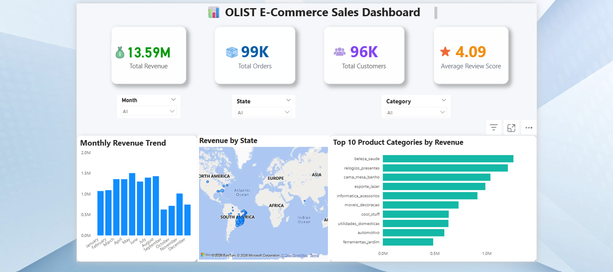

# 📊 Olist E-Commerce Sales Dashboard

## 📌 Overview

This project is an interactive **Power BI Dashboard** built using the **Brazilian Olist E-Commerce Public Dataset**. It provides insights into sales performance, customer behavior, and product category trends through interactive visualizations.

---

## 📷 Dashboard Preview

---

## 🎥 Dashboard Demo

Watch the demo video by opening **dashboard-demo.mp4** from this repository.

---

## 📊 Dataset

- Brazilian Olist E-Commerce Public Dataset
- ~100K Orders
- ~99K Customers
- ~112K Order Items
- ~100K Reviews
- ~103K Payments

---

## 🛠️ Tools & Technologies

- Power BI
- Power Query
- DAX
- Data Modeling

---

## 📈 Dashboard Features

- Total Revenue KPI
- Total Orders KPI
- Total Customers KPI
- Average Review Score
- Monthly Revenue Trend
- Revenue by State
- Top Product Categories
- Interactive Slicers

---

## 📥 Download Power BI File

**Power BI (.pbix) file:**

👉 https://drive.google.com/file/d/1XhenD486dTwQc0Yi4DuDiN4v47MFQqCi/view?usp=sharing

---

## 💡 Key Learning

This project helped me improve my understanding of Power BI, DAX, Power Query, data modeling, and interactive dashboard design.

---

## 📬 Feedback

Thank you for visiting my project.

Any feedback or suggestions are always welcome and will help me continue learning and improving.
